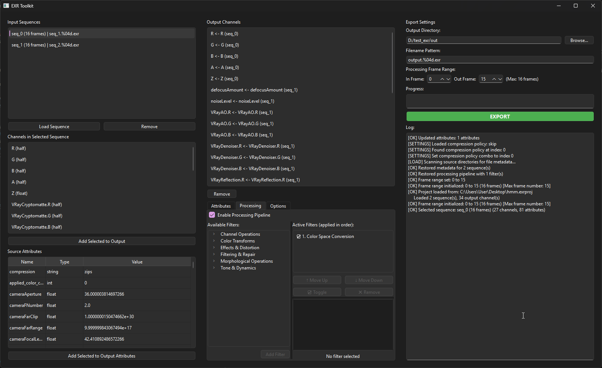

# EXR Toolkit

A desktop GUI application for advanced EXR image sequence manipulation, enabling users to load multiple sequences, inspect all channels and metadata, and recombine them into new EXR outputs with full control over attributes and export settings. Built on **OpenImageIO** for robust, high-performance image processing with native multithreading support.

## Features

### Core Capabilities
- **Multi-Sequence Loading**: Load and manage multiple image sequences with automatic frame discovery
- **Channel Inspection**: View all channels from loaded sequences with format information
- **Attribute Management**: Inspect and edit OpenEXR attributes (metadata) with full type preservation
- **Channel Recombination**: Select and rename channels from any sequence to create custom output channel sets
- **Frame Range Control**: Define in/out frame ranges for selective processing (limited to longest loaded sequence)
- **Metadata Preservation**: Never silently drops metadata; all attributes are first-class and editable
- **Multi-Select Operations**: Select multiple channels or attributes for batch operations
- **EXR Export Controls**: 
  - Compression selection (none, rle, zip, zips, piz, pxr24, b44, b44a, dwaa, dwab)
  - Frame policy selection (Stop at Shortest, Hold Last Frame, Process Available)
  - Custom attribute editing
- **Real-time Validation**: Validates export configuration before allowing export
- **Progress Tracking**: Live export progress and detailed logging

### Processing Pipeline
- **Non-Destructive Filter Stack**: Apply multiple image processing filters that execute during export
- **Filter Browser**: Browse available filters organized by category (Blur, Color Correction, Transformation, etc.)
- **Filter Management**:
  - Add filters to the pipeline by selecting from the browser
  - Reorder filters (↑/↓ buttons)
  - Enable/disable individual filters
  - Remove filters from the pipeline
- **Dynamic Parameter Editor**: Edit filter parameters with appropriate controls (spinboxes, dropdowns, checkboxes)
- **Pipeline Persistence**: Filter configurations are saved with project state
- **Available Filters**:
  - **Blur**: Median filter
  - **Enhancement**: Unsharp mask, brightness/contrast, gamma correction
  - **Color**: Color space conversion, channel inversion
  - **Transformation**: Warp transform, rotate
  - **Data Processing**: Fill holes, fix non-finite values, noise injection
  - **Morphology**: Dilate, erode
  - **Channel Operations**: Channel extract, channel invert
- **Pipeline UI**: Dual-pane interface with filter browser (45%) and pipeline editor (55%), both fully resizable

### Technical Highlights
- **OpenImageIO-Powered**: Built entirely on OpenImageIO (OIIO) for industry-standard, production-grade image I/O
- **High-Performance Export**: Multithreaded frame processing during export for efficient batch operations on multi-core systems
- **No Silent Conversions**: Channel format mismatches are explicitly detected and blocked
- **Cryptomatte Compatible**: Full support for Cryptomatte workflows through metadata preservation
- **Robust Format Handling**: Supports all channel formats exposed by OpenImageIO
- **Settings Persistence**: Remembers your preferences (directories, compression, frame policy)
- **Advanced Filters**: Leverages OIIO's ImageBufAlgo for reliable, hardware-optimized image operations (blur, color conversion, morphology, etc.)

## System Requirements

- **Python**: 3.12 or later
- **OS**: Windows, macOS, or Linux
- **Display**: 1600×950 minimum recommended
- **Dependencies**: See [requirements.txt](#requirementstxt)

## Installation

### Prerequisites

Ensure Python 3.12+ is installed on your system.

### Setup Steps

1. **Clone or download the repository**
   ```bash
   git clone https://github.com/yourusername/EXR_MP.git
   cd EXR_MP
   ```

2. **Create and activate a virtual environment**
   ```bash
   # Windows PowerShell
   python -m venv .venv
   .\.venv\Scripts\Activate.ps1
   
   # macOS/Linux
   python3 -m venv .venv
   source .venv/bin/activate
   ```

3. **Install dependencies**
   ```bash
   pip install -r requirements.txt
   ```

## Running the Application

Always activate the virtual environment first, then run:

```bash
# Windows PowerShell
.\.venv\Scripts\python.exe app/main.py

# macOS/Linux
.venv/bin/python app/main.py

# Or use the root launcher
python main.py
```

The application will start with a blank state. Begin by loading image sequences in the Input panel.

## Screenshot



*Main interface showing the Processing tab with filter browser (left), active pipeline (top-right), and parameter editor (bottom-right)*

## Usage Guide

### Loading Sequences

1. Click **"Load Sequence"** in the Input Sequences section (left panel)
2. Select a directory containing image files
3. The application auto-discovers sequences matching common patterns (e.g., `image.%04d.exr`, `image.####.exr`)
4. If multiple sequences are detected, select one
5. The application probes the first frame and displays channels and attributes

### Working with Channels

1. Select a sequence from the **Input Sequences** list
2. Available channels appear in the **Channels in Selected Sequence** section
3. Select one or more channels (Ctrl+Click for multi-select)
4. Click **"Add Selected to Output"** to add them to the output specification
5. In the **Output Channels** list, you can:
   - Select and remove channels (supports multi-select with Ctrl+Click)
   - See the source sequence and channel name for each output channel

### Managing Attributes

1. **Source Attributes**: When a sequence is selected, its attributes appear in the **Source Attributes** table
   - Table shows: Name, Type, Value
   - Supports multi-row selection

2. **Output Attributes**: In the **Attributes** tab:
   - Add attributes from source (click **"Add Selected to Output Attributes"**)
   - Edit attribute values (Name and Type are read-only)
   - Remove attributes with multi-select delete
   - The "compression" attribute is automatically added and synced with the Compression dropdown

### Setting Up Image Processing (Processing Tab)

The **Processing** tab allows you to apply non-destructive image filters during export. Filters are applied in order and can be enabled/disabled individually.

1. **Enable/Disable Pipeline**: Check **"Enable Processing Pipeline"** to activate filters during export (enabled by default)
2. **Browse Filters**: 
   - Left pane shows available filters organized by category
   - Hover over any filter to see its description and parameters
   - Click a filter to select it, then click **"Add Filter"** or double-click to add to the pipeline
3. **Manage Active Filters** (right pane):
   - **Active Filters list**: Shows filters in order of application
   - **↑ Move Up / ↓ Move Down**: Reorder filters (order matters!)
   - **☑ Toggle**: Enable/disable a filter without removing it
   - **✕ Remove**: Delete a filter from the pipeline
4. **Edit Filter Parameters** (bottom-right):
   - Click a filter in the list to show its parameters
   - Parameters display with appropriate controls (sliders, text boxes, dropdowns)
   - Changes apply immediately to the pipeline state
5. **Layout**: The left pane (filter browser) defaults to 45% width, right pane to 55%; you can adjust by dragging the splitter

**Example workflow**: Add Unsharp Mask → Brightness/Contrast → Color Space Conversion to enhance and color-correct before export.

### Export Configuration

1. **Output Directory**: Browse and select where to save the output sequence
2. **Filename Pattern**: Set the pattern (e.g., `beauty.%04d.exr` or `output.####.exr`)
3. **Processing Frame Range**:
   - **In Frame**: Starting frame (0-based index into sequence)
   - **Out Frame**: Ending frame (0-based index into sequence)
   - Max frame count updates automatically when new sequences are loaded
4. **Compression**: Choose EXR compression method
5. **Frame Policy**: Select how to handle sequences of different lengths
   - **Stop at Shortest**: Process only frames available in all sequences
   - **Hold Last Frame**: Reuse the last frame when a sequence ends
   - **Process Available**: Process all available frames

### Export

1. Ensure all validations pass (check the log for any ERROR messages)
2. Click **"EXPORT"** to begin
3. The button changes to **"STOP"** during export—click to cancel
4. Monitor progress in the Progress bar and Log pane
5. All output messages are logged with timestamps
6. All enabled filters from the Processing pipeline are applied to each frame

### Settings

Settings are automatically saved to `settings.ini` and include:
- Last input/output directories
- EXR compression preference
- Frame policy preference

## Project Structure

```
EXR_MP/
├── app/
│   ├── __init__.py
│   ├── main.py                 # Application entry point
│   ├── core/                   # Core data types and business logic
│   │   ├── __init__.py
│   │   ├── types.py            # Dataclasses: SequenceSpec, ChannelSpec, ExportSpec, etc.
│   │   ├── sequence.py         # Sequence pattern discovery
│   │   └── validation.py       # Export validation rules
│   ├── oiio/                   # OpenImageIO integration
│   │   ├── __init__.py
│   │   └── adapter.py          # OIIO wrapper and type mapping
│   ├── processing/             # Image processing pipeline system
│   │   ├── __init__.py
│   │   ├── filters.py          # Filter definitions (15+ filters: blur, color, transform, etc.)
│   │   ├── pipeline.py         # ProcessingPipeline container and serialization
│   │   └── executor.py         # Applies filters to ImageBuf during export
│   ├── services/               # Application services
│   │   ├── __init__.py
│   │   ├── project_state.py    # In-memory project state (sequences, export config, pipeline)
│   │   ├── settings.py         # Settings persistence (INI file)
│   │   └── export_runner.py    # Threaded export execution with pipeline integration
│   └── ui/                     # Qt 6 GUI components
│       ├── __init__.py
│       ├── main_window.py      # Main window orchestration (tabs: Input, Output, Processing, Export)
│       ├── models/             # Qt model classes
│       │   ├── __init__.py
│       │   └── qt_models.py    # List/Table models for sequences, channels, attributes
│       └── widgets/            # Custom Qt widgets
│           ├── __init__.py
│           ├── attribute_editor.py    # Attribute metadata editor with dialogs
│           ├── filter_browser.py      # Hierarchical filter selection tree (45% left pane)
│           ├── pipeline_list.py       # Active filter list with reorder/toggle/remove controls
│           ├── parameter_editor.py    # Dynamic parameter editor for selected filter
│           └── processing_widget.py   # Main Processing tab (integrates browser, list, editor)
├── main.py                     # Root launcher script
├── requirements.txt            # Python dependencies
├── settings.ini                # User settings (auto-created)
├── implementation.md           # Detailed technical specification
├── update_journal.md           # Development log
└── README.md                   # This file
```

## Requirements.txt

The project requires the following Python packages:

| Package | Version | Purpose |
|---------|---------|---------|
| **PySide6** | ≥6.6.0 | Qt 6 GUI framework (cross-platform UI) |
| **OpenImageIO** | ≥2.5.0 | Image I/O library for EXR manipulation |
| **numpy** | ≥1.24.0 | Numerical array operations for pixel buffer handling |

### Verifying Requirements

All required packages are specified in `requirements.txt`. To verify your environment:

```bash
pip list
```

Should show:
- `PySide6` (6.6.0+)
- `OpenImageIO` (2.5.0+)  
- `numpy` (1.24.0+)

All three dependencies are essential:
- **PySide6**: Provides the GUI framework
- **OpenImageIO**: Required for EXR reading/writing and attribute handling
- **numpy**: Used internally by the export runner for pixel buffer assembly

## Troubleshooting

### "ModuleNotFoundError: No module named 'OpenImageIO'"

**Solution**: Ensure OpenImageIO Python bindings are properly installed:
```bash
pip install OpenImageIO
```

If installation fails, your system may need to install OpenImageIO libraries separately (varies by OS).

### "ModuleNotFoundError: No module named 'PySide6'"

**Solution**:
```bash
pip install PySide6
```

### Application won't start or crashes immediately

1. Check the Python version: `python --version` (must be 3.12+)
2. Verify virtual environment is activated
3. Check console output for specific error messages
4. Review `update_journal.md` for known issues

### Sequences not discovered

- Ensure files match standard naming patterns:
  - Printf-style: `image.%04d.exr`
  - Hash-style: `image.####.exr`
- Files must be in a single directory
- Verify files are readable EXR format

### Export fails with validation errors

Check the log pane (bottom-right) for specific errors:
- **"No output channels defined"**: Add at least one channel to the output specification
- **"Output directory not set"**: Browse and select an output directory
- **"Channel format mismatch"**: Ensure all source channels are compatible

## Configuration

### settings.ini

User preferences are stored in `settings.ini` (auto-created on first run):

```ini
[preferences]
last_input_dir = /path/to/last/input/directory
last_output_dir = /path/to/last/output/directory
exr_compression = dwab
frame_policy = STOP_AT_SHORTEST
```

## Advanced Topics

### Processing Pipeline Architecture

The processing system is entirely non-destructive and optional:

- **Pipeline Model** (`ProcessingPipeline`): Container for an ordered list of filters with enabled/disabled state
- **Filter Registry**: 15+ filters organized by category (blur, color, transform, data cleaning, morphology, channels)
- **Executor** (`ProcessingExecutor`): Applies filters sequentially to each frame's ImageBuf during export
- **Serialization**: Pipeline state (filters and parameters) is serialized to project files and survives app restarts

**Filter Categories**:
- **Blur**: Median filter (radius-based noise reduction)
- **Enhancement**: Unsharp mask, brightness/contrast, gamma correction
- **Color**: Color space conversion, channel inversion
- **Transformation**: Warp transform, rotate
- **Data**: Fill holes, fix non-finite values, noise injection
- **Morphology**: Dilate, erode
- **Channels**: Channel extract, channel invert

### Frame Policy Details

The frame policy determines behavior when input sequences have different frame counts:

- **STOP_AT_SHORTEST**: Align sequences by frame number; stop when any sequence runs out
- **HOLD_LAST**: When a sequence ends, reuse its last available frame
- **PROCESS_AVAILABLE**: For each output frame, process if all source channels are available; skip if missing

### Cryptomatte Support

Cryptomatte workflows are fully supported:
1. Load sequences containing Cryptomatte channels and attributes
2. Add Cryptomatte channels to output (e.g., `crypto_object`, `crypto_object_id`)
3. Ensure all `cryptomatte/*` attributes are preserved
4. Optional: Apply filters (e.g., dilate) for matte refinement
5. Export normally—no special configuration needed

The application preserves all metadata exactly as stored, ensuring Cryptomatte validation succeeds.

### Batch Workflows

While the GUI is interactive, you can prepare export configurations:
1. Load sequences and configure output channels
2. Set up processing filters (optional)
3. Set export parameters (directory, pattern, compression, attributes)
4. Click Export
5. Repeat with different parameters as needed

For fully automated batch processing, future versions may support scripted export via a Python API.

## Known Limitations

- **Single-Part EXR**: Multi-part/multi-subimage EXR files are supported for reading but output is always single-part
- **Resolution Matching**: All sequences must have matching resolution (no resampling yet)
- **Interactive Only**: GUI is interactive; no command-line API yet
- **Filter Preview**: Processing pipeline cannot be previewed on a live frame (applies only at export time)
- **OIIO-Limited Filters**: Filter library is bound by OpenImageIO's ImageBufAlgo capabilities

## License

This project is licensed under the [MIT License](https://opensource.org/licenses/MIT).

---

**Version**: 0.2.0 (Alpha)  
**Last Updated**: January 12, 2026
